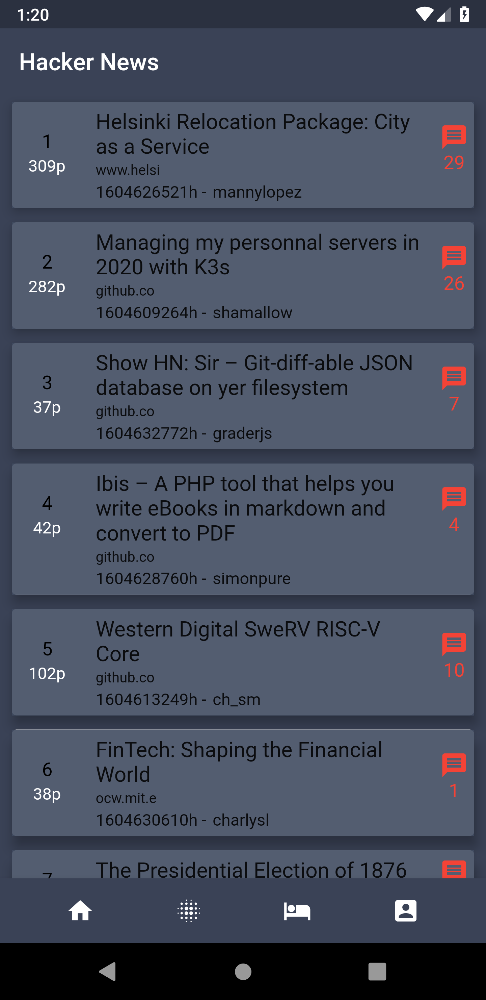
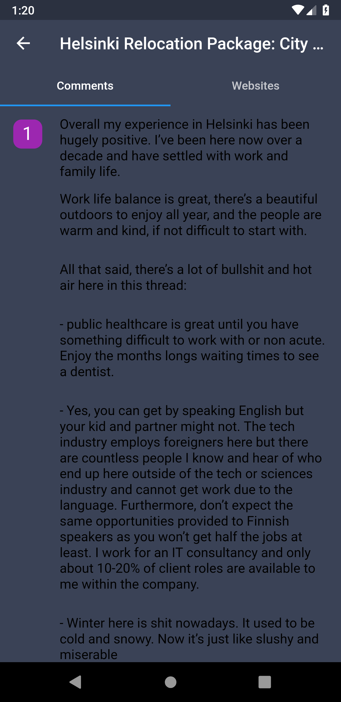

# hacker_news_for_qtec

## Documentation

##Fetching Top Stories

The first step is to implement a web service to fetch top stories. There are several packages available to perform networking tasks in Flutter.

For the sake of simplicity, I have used the http package. Install the package by adding the http package in the pubspec.yaml.

I have implemented  getTopStories method in a Webservice.dart file. The implementation is shown below:

 void _populateTopStories() async {
    final responses = await Webservice().getTopStories();
    final stories = responses.map((response) {
      final json = jsonDecode(response.body);
      return Story.fromJSON(json);
    }).toList();

    setState(() {
      _stories = stories;
    });
  }

We used the http package to invoke the following URL:

https://hacker-news.firebaseio.com/v0/topstories.json?print=pretty

The response from the above URL, returns an array of story IDs. I have used those IDs to retrieve the actual stories and utilize Future.wait to wait for all the responses.
https://hacker-news.firebaseio.com/v0/item/25003999.json?print=pretty

Once all the responses have been evaluated, a Future<List<Response>> is returned to the caller.
  
##Displaying Top Stories

The TopArticleList widget is responsible for displaying the top Hacker News stories to the user. I called _populateTopStories inside the initState method, as shown in the implementation below:

class TopArticleList extends StatefulWidget {
  TopArticleList({Key key, this.title}) : super(key: key);
  final String title;

  @override
  _TopArticleListState createState() => _TopArticleListState();
}

class _TopArticleListState extends State<TopArticleList> {
  List<Story> _stories = List<Story>();

  @override
  void initState() {
    super.initState();
    _populateTopStories();
  }

  void _populateTopStories() async {
    final responses = await Webservice().getTopStories();
    final stories = responses.map((response) {
      final json = jsonDecode(response.body);
      return Story.fromJSON(json);
    }).toList();

    setState(() {
      _stories = stories;
    });
  }

The build function is responsible for creating the user interface for the app. The implementation is shown below:

  @override
  Widget build(BuildContext context) {
    final topAppBar = AppBar(
      elevation: 0.1,
      backgroundColor: Color.fromRGBO(58, 66, 86, 1.0),
      title: Text(widget.title),
    );

    final makeBottom = Container(
      height: 55.0,
      child: BottomAppBar(
        color: Color.fromRGBO(58, 66, 86, 1.0),
        child: Row(
          mainAxisAlignment: MainAxisAlignment.spaceEvenly,
          children: <Widget>[
            IconButton(
              icon: Icon(Icons.home, color: Colors.white),
              onPressed: () {},
            ),
            IconButton(
              icon: Icon(Icons.blur_on, color: Colors.white),
              onPressed: () {},
            ),
            IconButton(
              icon: Icon(Icons.hotel, color: Colors.white),
              onPressed: () {},
            ),
            IconButton(
              icon: Icon(Icons.account_box, color: Colors.white),
              onPressed: () {},
            )
          ],
        ),
      ),
    );

    final makeBody = Container(
        child: ListView.builder(
      scrollDirection: Axis.vertical,
      shrinkWrap: true,
      itemCount: _stories.length,
      itemBuilder: (BuildContext context, int index) {
        return Card(
            elevation: 8.0,
            margin: new EdgeInsets.symmetric(horizontal: 10.0, vertical: 6.0),
            child: Container(
              decoration: BoxDecoration(color: Color.fromRGBO(64, 75, 96, .9)),
              child: ListTile(
                  onTap: () {
                    _navigateToShowCommentsPage(context, index);
                  },
                  contentPadding:
                      EdgeInsets.symmetric(horizontal: 5.0, vertical: 2.0),
                  leading: Container(
                      child: new Container(
                    width: 50,
                    height: 50,
                    padding: const EdgeInsets.all(6.0),
                    child: Column(
                      children: <Widget>[
                        Text("${index + 1}",
                            style:
                                TextStyle(color: Colors.black, fontSize: 16)),
                        SizedBox(
                          height: 3.0,
                        ),
                        Text("${_stories[index].points}p",
                            style: TextStyle(color: Colors.white)),
                      ],
                    ),
                  )),
                  title: Column(
                    crossAxisAlignment: CrossAxisAlignment.start,
                    children: <Widget>[
                      Text(_stories[index].title,
                          style: TextStyle(fontSize: 18),
                          textAlign: TextAlign.left),
                      SizedBox(
                        height: 3.0,
                      ),
                      Text(
                        _stories[index].url.substring(8),
                        style: TextStyle(fontSize: 12),
                        textAlign: TextAlign.left,
                      ),
                      SizedBox(
                        height: 3.0,
                      ),
                      Row(
                        children: <Widget>[
                          Text(
                            "${_stories[index].time}h - ",
                            style: TextStyle(fontSize: 14),
                            textAlign: TextAlign.left,
                          ),
                          SizedBox(
                            width: 1.0,
                          ),
                          Text(
                            _stories[index].by,
                            style: TextStyle(fontSize: 14),
                            textAlign: TextAlign.left,
                          ),
                        ],
                      )
                    ],
                  ),
                  // subtitle: Text("Intermediate", style: TextStyle(color: Colors.white)),
                  trailing: Column(
                    children: <Widget>[
                      Icon(
                        Icons.message,
                        color: Colors.red,
                      ),
                      SizedBox(
                        width: 1.0,
                      ),
                      Text(
                        "${_stories[index].commentIds.length}",
                        style: TextStyle(fontSize: 16, color: Colors.red),
                        textAlign: TextAlign.end,
                      ),
                    ],
                  )),
            ));
      },
    ));

    return Scaffold(
      backgroundColor: Color.fromRGBO(58, 66, 86, 1.0),
      appBar: topAppBar,
      body: makeBody,
      bottomNavigationBar: makeBottom,

    );
  }

I have also added a new page which displays list of comments and an article tab taht invokes a web view with the stories'url.
class CommentListPage extends StatefulWidget {
  final List<Comment> comments;
  final Story story;

  CommentListPage({Key key, this.story, this.comments}) : super(key: key);

  @override
  _CommentListPageState createState() => _CommentListPageState(story, comments);
}

class _CommentListPageState extends State<CommentListPage> with AutomaticKeepAliveClientMixin<CommentListPage>{
  final List<Comment> comments;
  final Story story;

  _CommentListPageState(this.story, this.comments);

  final Completer<WebViewController> _controller =
      Completer<WebViewController>();

  num position = 1;

  final key = UniqueKey();

  doneLoading(String A) {
    setState(() {
      position = 0;
    });
  }

  startLoading(String A) {
    setState(() {
      position = 1;
    });
  }

  @override
  Widget build(BuildContext context) {
    return DefaultTabController(
      length: 2,
      child: Scaffold(
        backgroundColor: Color.fromRGBO(58, 66, 86, 1.0),
        appBar: AppBar(
          elevation: 0.1,
          backgroundColor: Color.fromRGBO(58, 66, 86, 1.0),
          bottom: TabBar(
            tabs: [
              Tab(
                text: "${this.comments.length} Comments",
              ),
              Tab(text: "Websites"),
            ],
          ),
          title: Text(this.story.title),
        ),
        body: TabBarView(
          children: [
            Center(
                child: ListView.builder(
              itemCount: this.comments.length,
              itemBuilder: (context, index) {
                return ListTile(
                    leading: Container(
                        alignment: Alignment.center,
                        width: 35,
                        height: 35,
                        decoration: BoxDecoration(
                            color: Colors.purple,
                            borderRadius:
                                BorderRadius.all(Radius.circular(10))),
                        child: Text("${1 + index}",
                            style:
                                TextStyle(fontSize: 22, color: Colors.white))),
                    title: Padding(
                      padding: const EdgeInsets.only(top: 8.0),
                      child: Html(
                        data: this.comments[index].text,
                      ),
                      //style: TextStyle(fontSize: 14, color: Colors.white), textAlign: TextAlign.justify,),
                    ));
              },
            )),
            IndexedStack(
              children: <Widget>[
                WebView(
                  initialUrl: this.story.url,
                  key: key,
                  onPageStarted: startLoading,
                  onPageFinished: doneLoading,
                  javascriptMode: JavascriptMode.unrestricted,
                  onWebViewCreated: (WebViewController webViewController) {
                    _controller.complete(webViewController);
                  },
                ),
                Container(
                  color: Colors.red,
                  child: Center(
                      child: CircularProgressIndicator(
                    backgroundColor: Colors.red,
                  )),
                ),
              ],
            ),
          ],
        ),
      ),
    );
  }
  @override
  bool get wantKeepAlive => true;

}

The screenshot below shows the result:
<h1 align="center">

 
 
</h1>
